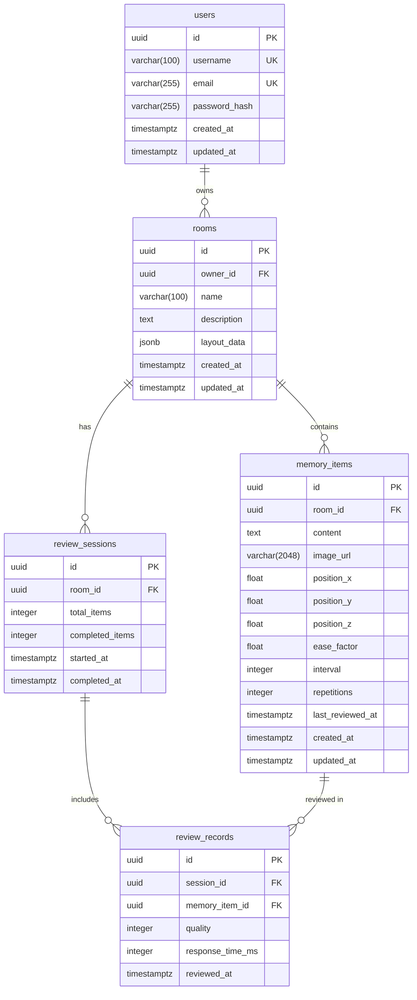

# データベーススキーマ

## ER図

## テーブル詳細

### users
ユーザーアカウント情報を管理する。

| カラム | 型 | 制約 | 説明 |
|---|---|---|---|
| id | UUID | PK | ユーザーID |
| username | VARCHAR(100) | UNIQUE, NOT NULL | ユーザー名 |
| email | VARCHAR(255) | UNIQUE, NOT NULL | メールアドレス |
| password_hash | VARCHAR(255) | NOT NULL | パスワードハッシュ |
| created_at | TIMESTAMPTZ | NOT NULL, DEFAULT now() | 作成日時 |
| updated_at | TIMESTAMPTZ | NOT NULL, DEFAULT now() | 更新日時 |

### rooms
記憶宮殿のルーム（3D空間）を管理する。

| カラム | 型 | 制約 | 説明 |
|---|---|---|---|
| id | UUID | PK | ルームID |
| owner_id | UUID | FK(users.id), NOT NULL | 所有者ユーザーID |
| name | VARCHAR(100) | NOT NULL | ルーム名（1-100文字） |
| description | TEXT | NULL | ルーム説明 |
| layout_data | JSONB | NULL | 3Dレイアウトデータ（床、壁、装飾） |
| created_at | TIMESTAMPTZ | NOT NULL, DEFAULT now() | 作成日時 |
| updated_at | TIMESTAMPTZ | NOT NULL, DEFAULT now() | 更新日時 |

### memory_items
ルーム内に配置される記憶アイテム。SM-2 パラメータを保持する。

| カラム | 型 | 制約 | 説明 |
|---|---|---|---|
| id | UUID | PK | アイテムID |
| room_id | UUID | FK(rooms.id), NOT NULL | 所属ルームID |
| content | TEXT | NOT NULL | 記憶対象テキスト（1-10,000文字） |
| image_url | VARCHAR(2048) | NULL | 画像URL |
| position_x | FLOAT | NOT NULL, DEFAULT 0.0 | X座標（-1000.0〜1000.0） |
| position_y | FLOAT | NOT NULL, DEFAULT 0.0 | Y座標（-1000.0〜1000.0） |
| position_z | FLOAT | NOT NULL, DEFAULT 0.0 | Z座標（-1000.0〜1000.0） |
| ease_factor | FLOAT | NOT NULL, DEFAULT 2.5 | SM-2 難易度係数（最小 1.3） |
| interval | INTEGER | NOT NULL, DEFAULT 1 | 復習間隔（日数） |
| repetitions | INTEGER | NOT NULL, DEFAULT 0 | 連続正答回数 |
| last_reviewed_at | TIMESTAMPTZ | NULL | 最終復習日時 |
| created_at | TIMESTAMPTZ | NOT NULL, DEFAULT now() | 作成日時 |
| updated_at | TIMESTAMPTZ | NOT NULL, DEFAULT now() | 更新日時 |

### review_sessions
復習セッションを管理する。途中中断時のロールバックに対応。

| カラム | 型 | 制約 | 説明 |
|---|---|---|---|
| id | UUID | PK | セッションID |
| room_id | UUID | FK(rooms.id), NOT NULL | 対象ルームID |
| total_items | INTEGER | NOT NULL, DEFAULT 0 | セッション内の合計アイテム数 |
| completed_items | INTEGER | NOT NULL, DEFAULT 0 | 完了アイテム数 |
| started_at | TIMESTAMPTZ | NOT NULL, DEFAULT now() | 開始日時 |
| completed_at | TIMESTAMPTZ | NULL | 完了日時（進行中は NULL） |

### review_records
復習セッション内の個別レビュー記録。

| カラム | 型 | 制約 | 説明 |
|---|---|---|---|
| id | UUID | PK | レコードID |
| session_id | UUID | FK(review_sessions.id), NOT NULL | 所属セッションID |
| memory_item_id | UUID | FK(memory_items.id), NOT NULL | 対象アイテムID |
| quality | INTEGER | NOT NULL | 自己評価（0-5） |
| response_time_ms | INTEGER | NOT NULL | 回答時間（ミリ秒、上限 300,000） |
| reviewed_at | TIMESTAMPTZ | NOT NULL, DEFAULT now() | レビュー日時 |

## SM-2 パラメータのデフォルト値

| パラメータ | デフォルト値 | 説明 |
|---|---|---|
| ease_factor | 2.5 | 難易度係数。最小 1.3 |
| interval | 1 | 復習間隔（日数）。初回は 1日 |
| repetitions | 0 | 連続正答回数。quality < 3 でリセット |

## 外部キー削除ポリシー

全ての外部キーに `ON DELETE CASCADE` を設定。親レコード削除時に関連レコードも自動削除される。
